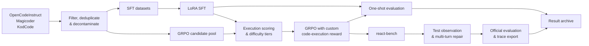

# Execution-Guided Code Reasoning

**An end-to-end research portfolio for code-model post-training and agentic evaluation.**

[中文说明](README_zh.md) · [Architecture](docs/ARCHITECTURE.md) · [Results](docs/RESULTS.md) · [Reproducibility](docs/REPRODUCIBILITY.md) · [Repository map](docs/REPOSITORY_MAP.md)

This repository studies one question from two connected directions:

> How can execution feedback improve a code model during training, and how can the same signal help the model repair its answer at inference time?

The first workstream builds post-training pipelines for Qwen-based code models: data curation, supervised fine-tuning (SFT), execution-scored GRPO, and benchmark evaluation. The second builds `react-bench`, a benchmark-oriented agent loop that lets a model submit Python, observe test feedback, repair its answer, and export the resulting trajectories.

This is an **evidence-first research archive**, not a turnkey training release. It intentionally includes source code, configurations, processed-data snapshots, generated samples, logs, official evaluator outputs, and an experiment manifest so that the work can be inspected even without the original GPU environment or model weights.

## What I built

| Area | Work represented here | Where to inspect it |
| --- | --- | --- |
| Data engineering | Quality filtering, Python selection, deduplication, benchmark decontamination, token-length analysis, candidate-pool construction, offline execution scoring, and difficulty tiering | [`scripts/data/`](workstreams/model-post-training/scripts/data/) |
| Post-training | LoRA SFT and GRPO setups for Qwen3 1.7B/8B, including custom execution- and format-aware rewards | [`scripts/train/`](workstreams/model-post-training/scripts/train/) |
| Model evaluation | vLLM generation, LoRA merging, EvalPlus evaluation, LiveCodeBench subset evaluation, and multi-checkpoint comparisons | [`scripts/eval/`](workstreams/model-post-training/scripts/eval/) |
| Agent system | A typed multi-turn ReAct runner with benchmark adapters, output parsing, prompt compaction, forced-submit recovery, and provider abstractions | [`react_bench/`](workstreams/agent-benchmark/react_bench/) |
| Trace pipeline | Structured JSONL run logs, failed-prefix collection, teacher continuation, and SFT trace export | [`logging/`](workstreams/agent-benchmark/react_bench/logging/) and [`export/`](workstreams/agent-benchmark/react_bench/export/) |
| Experiment operations | Archived samples, console logs, official post-hoc evaluation, score summaries, and byte-level artifact inventory | [Qwen3-8B archive](workstreams/model-post-training/results/qwen3_8b_coderl_react_eval_20260504/) |

## System at a glance



The architecture separates model work from agent work. The model-training pipeline can be studied independently, while `react-bench` can evaluate any compatible model endpoint through its provider interface.

## Selected results

The most complete archive is the Qwen3-8B experiment snapshot dated **2026-05-04**.

| Evaluation setup | HumanEval | HumanEval+ | MBPP | MBPP+ | LCB diverse50 hidden |
| --- | ---: | ---: | ---: | ---: | ---: |
| Base model, one-shot | 85.98% | 80.49% | 87.57% | 74.87% | 30.00% |
| RL checkpoint 200, one-shot | 85.98% | 78.05% | 87.83% | 73.28% | 30.00% |
| RL checkpoint 200 + ReAct, up to 3 turns | 97.56% | 85.98% | 93.92% | 77.78% | 72.00% |

These rows document different inference protocols; the ReAct row is a repair-at-3 result with execution feedback, not a directly interchangeable pass@1 model score. The archive also shows that GRPO checkpoints did **not** improve every one-shot metric monotonically. That negative result is preserved because it is part of the engineering and research story, not hidden behind a best-number-only summary.

See [RESULTS.md](docs/RESULTS.md) for counts, protocol notes, 1.7B experiments, checkpoint comparisons, and direct links to evaluator artifacts.

## Repository layout

```text
.
├── README.md                       # Public-facing overview
├── README_zh.md                    # Chinese overview
├── docs/
│   ├── ARCHITECTURE.md               # Component boundaries and data flow
│   ├── RESULTS.md                    # Evidence-backed experiment summary
│   ├── REPRODUCIBILITY.md            # Environment, dependencies, and limitations
│   ├── REPOSITORY_MAP.md             # Detailed navigation and provenance
│   └── PUBLICATION_CHECKLIST.md       # Decisions to make before publishing
└── workstreams/
    ├── model-post-training/          # Complete cs639_final working snapshot
    └── agent-benchmark/              # Complete cs639_agentic working snapshot
```

The two workstream snapshots retain their original internal layouts and READMEs. Only their nested Git metadata was excluded; source provenance and commit IDs are recorded in [REPOSITORY_MAP.md](docs/REPOSITORY_MAP.md).

## Start here

- To understand the research system, read [the architecture walkthrough](docs/ARCHITECTURE.md).
- To review claims and metrics, read [the results report](docs/RESULTS.md).
- To inspect the post-training pipeline stage by stage, open the [original post-training guide](workstreams/model-post-training/README.md).
- To inspect the agent interface and CLI, open the [`react-bench` guide](workstreams/agent-benchmark/README.md).
- To audit the strongest result snapshot, open its [archive README](workstreams/model-post-training/results/qwen3_8b_coderl_react_eval_20260504/README.md) and [machine-readable summary](workstreams/model-post-training/results/qwen3_8b_coderl_react_eval_20260504/summary.json).

## Research takeaways

1. **Executable rewards require more than a training loop.** The project builds the surrounding data contracts, code extraction, test normalization, subprocess isolation, scoring, and tier construction needed to make them usable.
2. **Post-training gains are checkpoint- and protocol-sensitive.** Several SFT/GRPO variants underperform the base model on some metrics; the base-initialized hard-set GRPO run is the strongest 1.7B snapshot in the main table.
3. **Inference-time repair can change the operating point substantially.** With up to three turns and test feedback, the archived checkpoint solves many tasks that fail under one-shot generation.
4. **Public feedback is not hidden-test performance.** LiveCodeBench public repair reaches 82%, while the corresponding hidden evaluation is 72%; the repository reports both.
5. **Research artifacts matter.** Generated samples, failed prefixes, logs, manifests, and post-hoc audits make it possible to investigate failures rather than only quote aggregate scores.

## Scope and status

- Model weights, caches, virtual environments, and merged checkpoints are intentionally absent.
- Some original training scripts contain machine-specific absolute paths and need configuration work before reuse.
- The full snapshot is about 443 MB because it preserves processed data and generated outputs; see the [publication checklist](docs/PUBLICATION_CHECKLIST.md) before pushing to a hosting service.
- No license has been selected yet. Do not assume reuse rights until the repository owner adds one.

## Validation of this portfolio snapshot

- The two copied workstreams match their source working trees under a recursive comparison, excluding only nested `.git` and `.DS_Store` metadata.
- All 94 stored `.json` files parse successfully.
- All 63 Python files pass Python 3.12 AST parsing.
- The `react-bench` standard-library test suite passes all 61 tests on Python 3.12.
- All internal Markdown links introduced by the portfolio layer resolve to local files or directories.
- A high-confidence credential-pattern scan found no embedded private key or provider token; the separate public-release review is still recommended.

## Author

**Botao Rui**  
Originally developed as a CS639 final-project research codebase and reorganized here as a public-facing portfolio archive.
