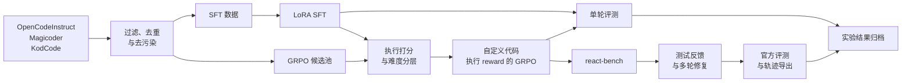

# 执行反馈驱动的代码推理

**一个完整展示代码模型 post-training 与 agentic evaluation 的研究型 portfolio。**

[English](README.md) · [系统架构](docs/ARCHITECTURE.md) · [实验结果](docs/RESULTS.md) · [复现说明](docs/REPRODUCIBILITY.md) · [仓库地图](docs/REPOSITORY_MAP.md)

这个项目从两个相互衔接的方向研究同一个问题：

> 如何在训练阶段用代码执行反馈改善模型，又如何在推理阶段用同样的信号让模型自我修复？

第一条工作线是 Qwen 代码模型的 post-training：数据整理、SFT、基于执行结果的 GRPO，以及系统评测。第二条工作线是 `react-bench`：模型可以提交 Python 代码、观察测试反馈、多轮修复答案，并把过程转化为可审计、可导出的轨迹数据。

这是一个**以研究证据为主的项目归档**，不是开箱即用的训练框架。仓库保留了源代码、配置、处理后数据、生成样本、日志、官方评测输出与实验 manifest。即使没有原始 GPU 环境和模型权重，读者也能看清楚完成了什么工作。

## 完成的工作

| 方向 | 项目内容 | 代码或证据 |
| --- | --- | --- |
| 数据工程 | 质量筛选、Python 样本选择、去重、benchmark 去污染、token 长度分析、候选池构建、离线执行打分和难度分层 | [`scripts/data/`](workstreams/model-post-training/scripts/data/) |
| 模型后训练 | Qwen3 1.7B/8B 的 LoRA SFT 和 GRPO，包括执行正确性与格式联合 reward | [`scripts/train/`](workstreams/model-post-training/scripts/train/) |
| 模型评测 | vLLM 生成、LoRA merge、EvalPlus、LiveCodeBench subset 评测和多 checkpoint 对比 | [`scripts/eval/`](workstreams/model-post-training/scripts/eval/) |
| Agent 系统 | 类型化的多轮 ReAct runner、benchmark adapter、输出 parser、prompt 压缩、超长输出强制 submit 恢复和 provider 抽象 | [`react_bench/`](workstreams/agent-benchmark/react_bench/) |
| 轨迹数据 | 结构化 JSONL 日志、失败 prefix 收集、teacher continuation 和 SFT 轨迹导出 | [`logging/`](workstreams/agent-benchmark/react_bench/logging/) 与 [`export/`](workstreams/agent-benchmark/react_bench/export/) |
| 实验工程 | 生成样本、console log、官方 post-hoc 评测、分数汇总和字节级 artifact 清单 | [Qwen3-8B 实验归档](workstreams/model-post-training/results/qwen3_8b_coderl_react_eval_20260504/) |

## 系统全景



## 代表性结果

项目 final report 将下表作为 Qwen3-8B 的最终主结果。

| 模型 / 设置 | HumanEval | HumanEval+ | MBPP | MBPP+ | LiveCodeBench（50 题） |
| --- | ---: | ---: | ---: | ---: | ---: |
| Qwen3-8B | 83.5% | 76.8% | 88.9% | 76.9% | 15/50 |
| RL 200 | 86.6% | 81.7% | 89.4% | 75.9% | 15/50 |
| RL 300 | 87.2% | 81.1% | 45.2% | 39.7% | - |
| RL 200 + ReAct runner，最多 3 轮 | **97.6%** | **86.0%** | **93.9%** | **77.8%** | **34/50** |

前三行的 first-attempt 评测使用 greedy decoding、16k 总 context budget 和 14k 最大输出长度。ReAct 系统使用稳定的 RL 200 checkpoint，通过可验证的执行反馈进行最多三轮修复；它**不是**经过 Agent SFT 的模型。

RL 200 在 HumanEval、HumanEval+ 和 MBPP 上超过 base model，但 MBPP+ 小幅下降。RL 300 的 HumanEval 继续提升，但 MBPP 和 MBPP+ 出现崩溃；人工检查发现了过长且格式错乱的 thinking、不完整提交和语法错误。相比之下，执行反馈驱动的 ReAct repair 将 LiveCodeBench 从 15/50 提高到 34/50，得到了整体最强的结果。

更完整的 1.7B/8B 结果、样本数、评测口径和原始证据链接见 [RESULTS.md](docs/RESULTS.md)。

## 仓库结构

```text
.
├── README.md                       # 英文项目首页
├── README_zh.md                    # 中文项目首页
├── docs/                           # 架构、结果、复现与发布说明
└── workstreams/
    ├── model-post-training/          # cs639_final 的完整工作快照
    └── agent-benchmark/              # cs639_agentic 的完整工作快照
```

两个 workstream 保持原有内部目录和 README 不变，只排除了不应该进入统一公开仓库的嵌套 `.git` 元数据。原始 remote 和 commit ID 记录在 [REPOSITORY_MAP.md](docs/REPOSITORY_MAP.md)。

## 建议阅读顺序

- 想快速理解整个系统：阅读 [架构说明](docs/ARCHITECTURE.md)。
- 想核对实验数据：阅读 [结果报告](docs/RESULTS.md)。
- 想查看 post-training 各阶段：打开 [原始 post-training 说明](workstreams/model-post-training/README_zh.md)。
- 想查看 agent 接口和 CLI：打开 [`react-bench` 说明](workstreams/agent-benchmark/README.md)。
- 想审计最完整的结果：打开 [8B archive README](workstreams/model-post-training/results/qwen3_8b_coderl_react_eval_20260504/README.md) 和 [summary.json](workstreams/model-post-training/results/qwen3_8b_coderl_react_eval_20260504/summary.json)。

## 范围与状态

- 仓库不包含模型权重、cache、虚拟环境和 merge 后 checkpoint。
- 部分原始训练脚本使用了特定机器的绝对路径，复用前需要做配置化修改。
- 完整快照约 443 MB，因为保留了处理后数据和生成结果；推送到 Git hosting 前请阅读 [公开发布清单](docs/PUBLICATION_CHECKLIST.md)。
- 当前尚未选择开源许可证。在仓库所有者正式添加 license 前，不应默认拥有复用权。

## 本次整理的验证结果

- 两个 workstream 与原始 working tree 通过递归对比，差异仅排除嵌套 `.git` 和 `.DS_Store` 元数据。
- 94 个 `.json` 文件全部可正常解析。
- 63 个 Python 文件全部通过 Python 3.12 AST 语法检查。
- `react-bench` 的 61 个标准库测试在 Python 3.12 下全部通过。
- Portfolio 层新增的 Markdown 内部链接全部可解析。
- 高置信度 credential pattern 扫描未发现内嵌私钥或 provider token；公开前仍建议执行清单中的最终审查。

## 作者

**Botao Rui**  
原始工作来自 CS639 final project，现统一整理为面向公众的研究 portfolio。
