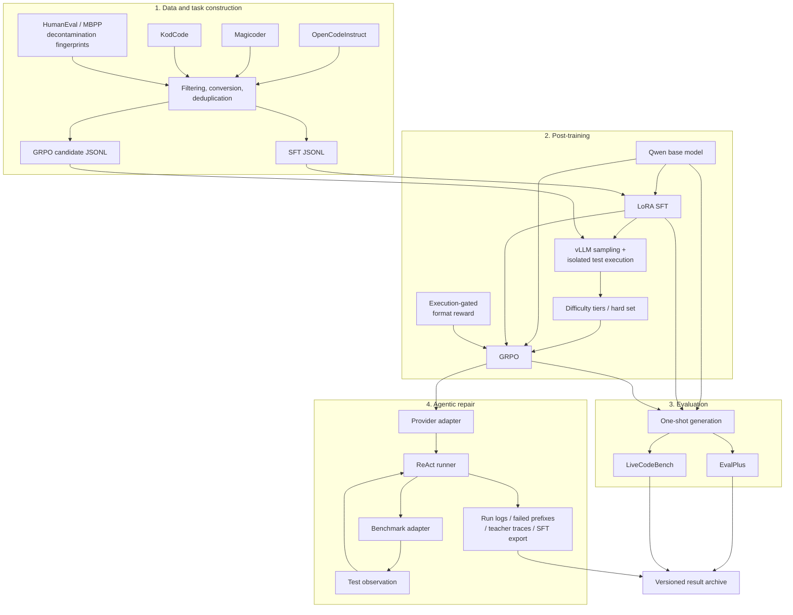

# Architecture

## Design goal

The project treats executable feedback as a shared primitive across two phases:

- **Training time:** execute candidate solutions, estimate problem difficulty, and optimize a model with correctness-aware rewards.
- **Inference time:** execute a model submission, return a bounded observation, and give the same model another chance to repair it.

This creates a connected research system without tightly coupling the training implementation to the agent runner.

## End-to-end flow



## Workstream A: model post-training

Location: [`workstreams/model-post-training/`](../workstreams/model-post-training/)

### Data layer

The data scripts do more than concatenate datasets. They implement the task transformations required for execution-based training:

- normalize OpenCodeInstruct and KodCode tests into executable assertions;
- filter low-quality, empty, overly long, and non-Python samples;
- deduplicate prompts within and across sources;
- remove overlaps with HumanEval, MBPP, and prior SFT data;
- sample deterministic mixtures with fixed seeds;
- score multiple completions per problem and persist resumable output;
- derive hard or tiered training subsets from empirical pass rates.

Key entry points:

- [`prepare_sft.py`](../workstreams/model-post-training/scripts/data/prepare_sft.py)
- [`build_grpo_pool.py`](../workstreams/model-post-training/scripts/data/build_grpo_pool.py)
- [`prepare_kodcode_sft_10k.py`](../workstreams/model-post-training/scripts/data/prepare_kodcode_sft_10k.py)
- [`score_and_tier.py`](../workstreams/model-post-training/scripts/data/score_and_tier.py)
- [`score_and_tier_qwen3_8b.py`](../workstreams/model-post-training/scripts/data/score_and_tier_qwen3_8b.py)

### Training layer

The 1.7B workstream explores SFT followed by GRPO, including a comparison between GRPO initialized from the base model and GRPO initialized from an SFT model. The 8B workstream focuses on direct hard-example GRPO with a larger reasoning budget.

The 8B reward is deliberately gated:

```text
code fails tests                         -> 0.0
code passes, final format is nonstandard -> 2.0
code passes, standard think+code format  -> 2.5
```

This makes correctness the prerequisite and formatting a smaller secondary signal. Test execution uses temporary directories, subprocess timeouts, process-group termination, and bounded worker concurrency.

Key entry points:

- [`1.7B/run_grpo.py`](../workstreams/model-post-training/scripts/train/1.7B/run_grpo.py)
- [`1.7B/reward_fn.py`](../workstreams/model-post-training/scripts/train/1.7B/reward_fn.py)
- [`8B/run_grpo.py`](../workstreams/model-post-training/scripts/train/8B/run_grpo.py)
- [`8B/reward_fn.py`](../workstreams/model-post-training/scripts/train/8B/reward_fn.py)
- [`8B/grpo_config.yaml`](../workstreams/model-post-training/scripts/train/8B/grpo_config.yaml)

### Evaluation layer

Evaluation is kept outside the training loop. The scripts can merge a LoRA adapter when necessary, generate benchmark-compatible samples with vLLM, and invoke official or established evaluators. Separate paths cover Qwen3 thinking modes and non-Qwen3 local baselines.

Key entry points:

- [`run_eval.py`](../workstreams/model-post-training/scripts/eval/run_eval.py)
- [`gen_samples.py`](../workstreams/model-post-training/scripts/eval/gen_samples.py)
- [`run_eval_vllm_generic.py`](../workstreams/model-post-training/scripts/eval/run_eval_vllm_generic.py)
- [`run_lcb_qwen3.py`](../workstreams/model-post-training/scripts/eval/run_lcb_qwen3.py)

## Workstream B: agent benchmark

Location: [`workstreams/agent-benchmark/`](../workstreams/agent-benchmark/)

### Core loop

`ReActRunner` owns orchestration, but delegates model calls and benchmark semantics:

```text
render task + prior turns
        |
        v
provider.generate(...)
        |
        v
parse <think> and <submit>
        |
        +-- truncated without submit --> forced-submit recovery call
        |
        v
benchmark_adapter.judge(...)
        |
        +-- pass --> finish
        |
        `-- fail --> compact observation --> next turn
```

This separation makes three things independently testable:

- **Provider adapters** own API-specific request and thinking-output handling.
- **Benchmark adapters** own task loading and judging for EvalPlus, LiveCodeBench-style, and KodCode-style tasks.
- **Protocol modules** own tagged-output parsing, trace schemas, prompt rendering, and compaction.

### Reliability features

- A `<submit>` contract separates executable code from reasoning.
- Native model thinking and explicit `<think>` tags are both supported.
- Prompt budgets and benchmark-specific compaction bound context growth.
- A length-triggered recovery call asks for code only when a model reasons until truncation.
- Full observations remain in logs while the model sees a smaller feedback payload.
- `stop_on_pass` and a maximum turn count give every run explicit termination conditions.

### Research-data outputs

The runner produces more than a final score:

- `runs.jsonl` contains full typed traces and token/latency metadata;
- `failed_prefixes.jsonl` captures states suitable for continuation or error analysis;
- teacher continuation can turn failed prefixes into successful trajectories;
- successful teacher traces can be exported as tagged SFT examples.

Key modules:

- [`agent/runner.py`](../workstreams/agent-benchmark/react_bench/agent/runner.py)
- [`benchmarks/`](../workstreams/agent-benchmark/react_bench/benchmarks/)
- [`providers/`](../workstreams/agent-benchmark/react_bench/providers/)
- [`protocol/`](../workstreams/agent-benchmark/react_bench/protocol/)
- [`distill.py`](../workstreams/agent-benchmark/react_bench/distill.py)
- [`export/sft.py`](../workstreams/agent-benchmark/react_bench/export/sft.py)

## Why the workstreams remain separate

The umbrella repository explains the connection but preserves the two original package boundaries:

1. the post-training scripts are experiment-oriented and depend on heavyweight GPU libraries;
2. `react-bench` is a small installable Python package with a standard-library core and its own tests;
3. training data, model checkpoints, runner traces, and official evaluation outputs have different lifecycle and storage needs;
4. keeping the boundaries visible makes individual contributions easier to review.

The shared contract is conceptual and file-based: task JSONL, model endpoints/checkpoints, generated solutions, observations, and trace JSONL.
